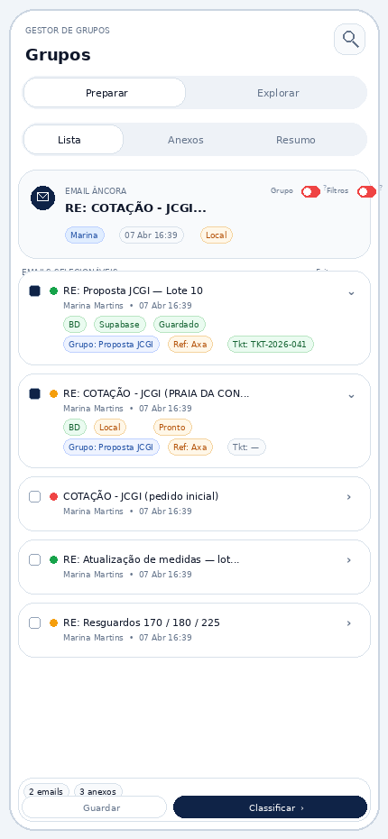
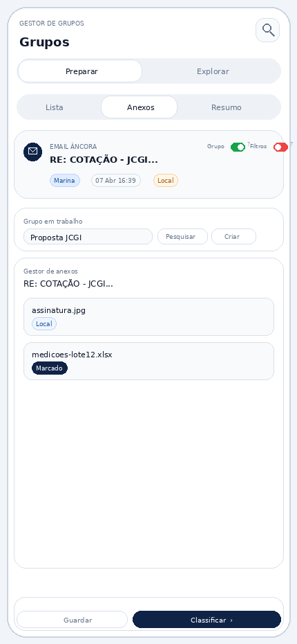
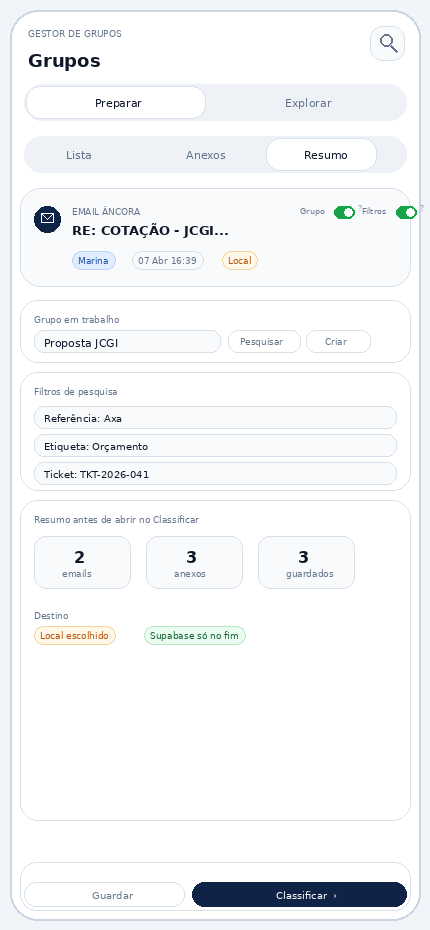
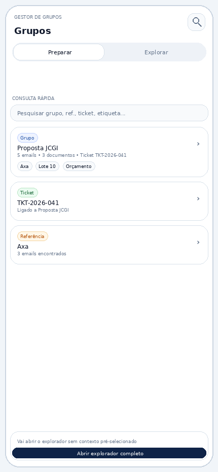
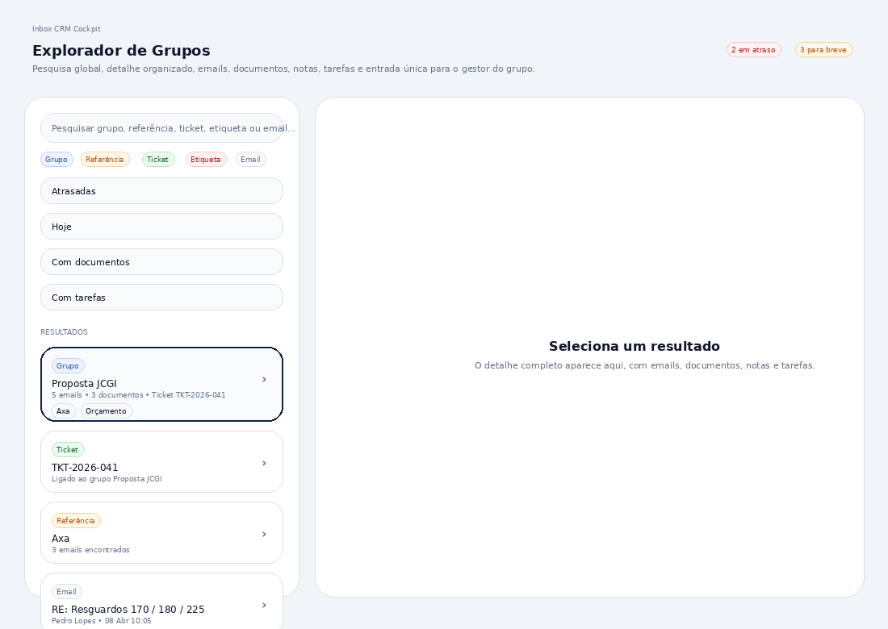
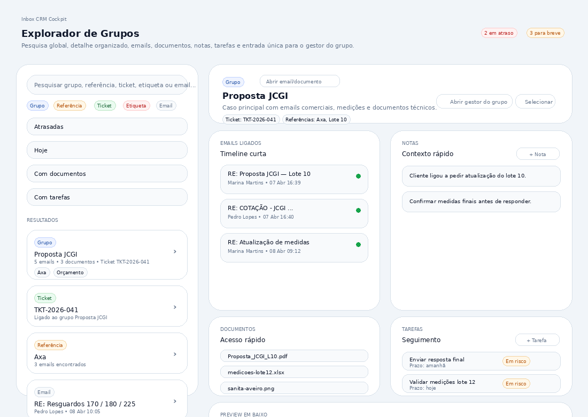
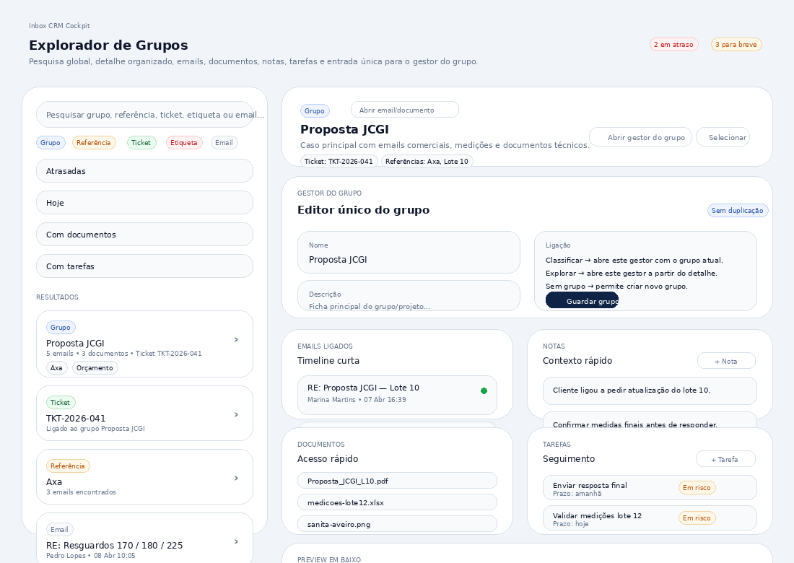

# Relatório base de implementação — Aba Grupos + Explorador de Grupos

**Projeto:** Inbox CRM Cockpit  
**Data:** 2026-04-09

## Leitura obrigatória para agents
- `AGENTS.md`
- `docs/HANDOFF.md`
- `docs/CODE_REVIEW.md`

## Finalidade
Fixar a estrutura funcional e visual da aba **Grupos** e do novo **Explorador de Grupos**, com regras de armazenamento, fluxo, mockups aprovados, etapas e critérios de fecho.

## Princípios fechados
- A app decide, a base de dados guarda, o Outlook só reflete.
- Grupo, referência, ticket e etiqueta são coisas diferentes.
- 1 email = 1 grupo principal.
- Cache do add-in = só sessão e retoma de trabalho.
- Grupos prepara e organiza; Classificar fecha.
- A edição completa de grupo não deve ficar duplicada em vários sítios.
- O editor completo do grupo vive no **Gestor do Grupo**, que o Explorador consulta e abre.

## Armazenamento
- **Cache do add-in:** seleções, filtros, estado da sessão, rascunho da operação.
- **Base principal escolhida pelo utilizador:** emails e anexos reais de trabalho.
- **Supabase:** só o que for promovido para lá.

### Modos previstos
1. Tudo no Supabase
2. Local neste PC
3. Local em pasta escolhida
4. Híbrido

### Regras
- Abrir um email não deve significar enviar logo tudo para o Supabase.
- Anexos acima de um limite configurável pedem decisão.
- Payloads pobres não podem apagar dados bons.
- Ao mudar de aba, abrir outro email ou sair do contexto, a app deve gravar o progresso da sessão antes de mudar.

## Estrutura da aba Grupos
### Preparar
- Tem **Email Âncora**.
- Tem switches ultra compactos **Grupo** e **Filtros**, ambos *off* por defeito.
- Sub-vistas:
  - Lista
  - Anexos
  - Resumo

### Explorar
- Não mostra Email Âncora.
- Não mostra contexto vindo de Preparar.
- É consulta global.
- Cada card abre detalhe curto no próprio add-in.
- No fundo existe botão para abrir o **Explorador de Grupos** completo.
- Se houver detalhe aberto, esse contexto segue para o explorador.
- Se não houver nada selecionado, o explorador abre do zero.

## Regras de UI
- Cada card de email pode expandir/retrair.
- Em retraído mostra só assunto, remetente, data e estado mínimo.
- Em expandido mostra labels, grupo, referências, ticket e anexos.
- Referência nunca aparece como grupo.
- Se um email mudar de grupo principal, deve haver aviso claro e opção de converter o grupo antigo em referência **só nesse email**.
- Grupo e filtros são opcionais e entram por switch.
- Menus escondidos por defeito para não sobrecarregar a entrada.
- Nomes curtos:
  - Emails selecionáveis
  - Filtros de pesquisa

## Explorador de Grupos — base v1
### Função
Ferramenta de consulta e acompanhamento para:
- pesquisa global
- detalhe organizado
- emails
- documentos
- notas
- tarefas
- entrada única para o gestor do grupo

### Estrutura
- coluna esquerda:
  - pesquisa
  - filtros rápidos
  - resultados
- coluna direita:
  - detalhe do item selecionado
  - emails ligados
  - documentos
  - notas
  - tarefas
- zona inferior:
  - preview reutilizável, no mesmo princípio do viewer do Classificar

### Itens pesquisáveis
- Grupo
- Referência
- Ticket
- Etiqueta
- Email

### Detalhe curto
Ao selecionar um resultado, o explorador mostra:
- resumo do item
- meta-informação
- emails ligados
- documentos
- notas
- tarefas

## Gestor do Grupo — regra fechada
- Não deve haver dois editores diferentes de grupo.
- A edição completa do grupo deve acontecer no **Gestor do Grupo**.
- O Explorador de Grupos consulta e pode abrir o Gestor com o contexto certo.
- O bloco intermédio tipo “gestor” no mockup do Explorador é ponte conceptual / ponto de entrada, não um segundo editor rico.
- O Classificar e a aba Grupos só devem abrir esse gestor com o contexto certo.

### Entradas previstas
1. **Resultado já é Grupo**
   - ação: `Abrir gestor do grupo`

2. **Resultado é Ticket ou Referência**
   - ação: `Abrir grupo relacionado`

3. **Resultado é Email sem grupo**
   - ação: `Criar grupo a partir deste email`

### Conteúdo do Gestor do Grupo
- nome
- descrição
- participantes
- notas
- tarefas
- documentos
- contexto comercial / técnico
- metadados do caso / projeto

## Notas e tarefas
### No add-in / detalhe curto
- mostrar notas e tarefas em modo leve
- permitir ações rápidas:
  - `+ Nota`
  - `+ Tarefa`

### Gestão mais completa
Foi decidido que haverá uma aba principal futura **Tarefas**, fora de Grupos, porque as tarefas são transversais:
- tarefas dos grupos
- tarefas do Odoo
- futura integração com outras fontes

## Etapas de implementação
| Etapa | Objetivo | Conteúdo | Fecho |
|---|---|---|---|
| E1 | Fechar modelo e settings | modos, gravação, cache, toggles, regras semânticas | aprovado quando nomes e regras estiverem fechados |
| E2 | Implementar Preparar | Email Âncora, switches, Lista, Anexos, Resumo | aprovado quando a UI base estiver fiel ao mockup |
| E3 | Persistência segura | guardado local / remoto, proteção contra payload pobre, retoma de sessão | aprovado quando o fluxo não perder dados |
| E4 | Ligação ao Classificar | passagem limpa de emails/anexos/grupo/contexto | aprovado quando abrir Classificar sem ruído |
| E5 | Implementar Explorar no add-in | pesquisa global, detalhe curto, botão para explorador completo | aprovado quando a consulta rápida estiver estável |
| E6 | Implementar Explorador de Grupos | pesquisa, detalhe, preview inferior, notas, tarefas | aprovado quando o explorador base estiver utilizável |
| E7 | Implementar Gestor do Grupo | editor único do grupo, chamado a partir do explorador | aprovado quando a edição completa deixar de estar duplicada |
| E8 | Módulo Tarefas (futuro) | aba principal dedicada a tarefas | fora do scope atual |

## Regra de fecho
Cada ronda só passa a fechada depois de aprovação final explícita do utilizador.

## Screenshots / mockups aprovados

### Preparar — Lista

### Preparar — Anexos

### Preparar — Resumo

### Explorar no add-in

### Explorador — Pesquisa global

### Explorador — Detalhe + preview

### Explorador — Gestor do grupo

## Instruções para agents
- Ler primeiro:
  - `AGENTS.md`
  - `docs/HANDOFF.md`
  - `docs/CODE_REVIEW.md`
- Seguir este relatório à risca.
- Não alterar semântica de grupo / referência / ticket / etiqueta.
- Não duplicar o editor de grupo.
- Fechar etapas uma a uma, só após aprovação do utilizador.
