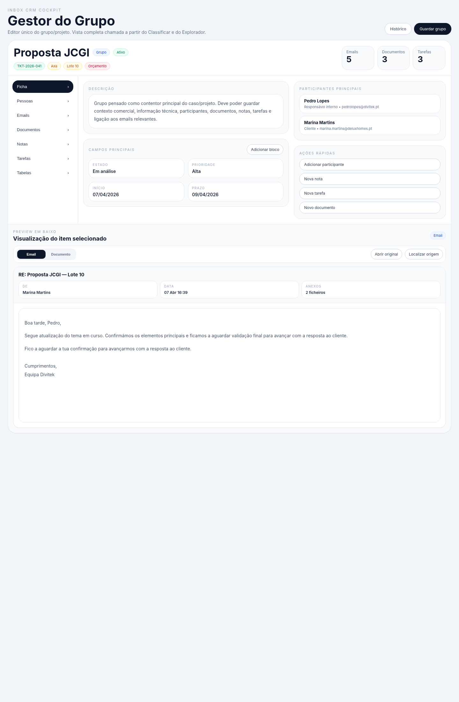

# Relatório — Mockup do Gestor do Grupo

**Data:** 2026-04-09

Este relatório documenta apenas o mockup do **Gestor do Grupo**, já com a versão aprovada do visualizador/preview no fundo a ocupar toda a largura da janela.

## Pontos fechados
- Editor único do grupo/projeto.
- Chamado a partir do Classificar e do Explorador.
- Secções previstas: Ficha, Pessoas, Emails, Documentos, Notas, Tarefas e Tabelas.
- Preview em baixo, full-width, para emails e documentos.
- Emails e documentos atualizam o preview ao serem selecionados.

**Estado do mockup:** aprovado

## Screenshot

